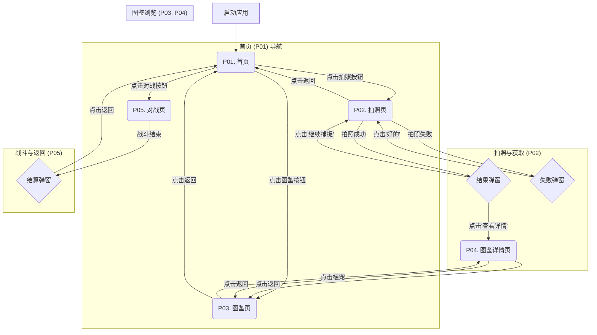

### **《Plantmon》游戏需求文档 (GRD)**

*   **文档版本:** V1.0
*   **创建日期:** 2023-10-27
*   **核心理念:** 一款结合AI图像识别的、轻度的宠物收集与对战游戏。核心玩法在于“万物皆可为宠”，通过拍摄现实世界中的物体，生成独一无二的战斗伙伴——“植宠”。

---

### **1. 游戏核心玩法循环 (Core Gameplay Loop)**

玩家的主要动线如下：
`启动游戏` -> `进入首页` -> `点击拍照` -> `识别物体生成植宠` -> `在图鉴中查看/设为出战` -> `进入对战` -> `返回首页`

---

### **2. 页面功能详述 (Detailed Page Functions)**

#### **P01. 首页 (Home Page)**

*   **功能描述:** 游戏的主入口和玩家的个人空间，展示玩家的核心“植宠”和主要功能入口。
*   **入口:** 启动游戏后的默认页面。
*   **核心功能:**
    1.  **背景与Logo:**
        *   全屏背景图，营造游戏世界观氛围。
        *   页面顶部或显眼位置展示游戏LOGO。
    2.  **植宠展示区 (核心区域):**
        *   **状态一 (无植宠):** 当玩家首次进入游戏或没有捕获任何植宠时，此区域显示一个引导性的默认形象（如一个等待孵化的“种子”或“培養皿”）或提示文字，如“快去捕获你的第一只植宠吧！”。
        *   **状态二 (有植宠):** 当玩家已有捕获的植宠时，此区域展示玩家**当前设置为“出战”状态**的植宠。要求有idle（待机）的动态效果。
    3.  **导航按钮:**
        *   **[核心按钮] 拍照/捕获 (Capture):**
            *   **视觉设计:** 此按钮为最重要的交互按钮。设计上需要有原创性，结合“植物”与“捕获”两大主题。**建议方案：“魔力培养皿”或“基因采集铲”**。点击时应有独特的音效和视觉动效。
            *   **跳转:** 点击后跳转至 **P02. 拍照页**。
        *   **图鉴 (Index):**
            *   **视觉设计:** 可使用通用、简洁的图标，如“书本”或“列表”图标。
            *   **跳转:** 点击后跳转至 **P03. 图鉴页**。
        *   **对战 (Battle):**
            *   **视觉设计:** 可使用通用、易于理解的图标，如“双剑交叉”或“VS”图标。
            *   **跳转:** 点击后跳转至 **P05. 对战页**。

---

#### **P02. 拍照页 (Capture Page)**

*   **功能描述:** 游戏的核心输入页面，玩家通过此页面调用相机，识别真实物体，生成新的“植宠”。
*   **入口:** 从 **P01. 首页** 点击“拍照/捕获”按钮。
*   **核心功能:**
    1.  **相机界面:**
        *   默认打开后置摄像头，全屏预览。
        *   界面四角或边缘有科技感/魔法感的**拍照边框**，增强沉浸感。
    2.  **拍照识别按钮:**
        *   **设计:** 复用首页的核心按钮设计（如“魔力培养皿”），保持品牌一致性。
        *   **交互:** 点击后触发拍照动作。
    3.  **捕获与加载流程:**
        *   拍照后，照片上传至后端API进行AI识别。
        *   **期间，前端必须展示一个明确的加载状态。** 建议实现一个**捕获动画**，例如：从按钮处飞出一个光球或藤蔓，将屏幕中的照片“吸收”进去，随后显示“AI分析中...”或“基因重组中...”的加载提示。
    4.  **结果弹窗 (Modal):**
        *   **捕获成功:**
            *   弹窗展示新捕获的“植宠”形象和名称。
            *   **按钮1: “查看详情”** -> 点击后跳转至 **P04. 图鉴详情页**，展示这只新植宠的具体信息。
            *   **按钮2: “继续捕捉”** -> 点击后关闭弹窗，停留在 **P02. 拍照页**。
        *   **捕获失败:**
            *   弹窗提示“识别失败，请换个角度或物体试试吧！”。
            *   **按钮: “好的”** -> 点击后关闭弹窗，停留在 **P02. 拍照页**，引导玩家重新拍照。

---

#### **P03. 图鉴页 (Index List Page)**

*   **功能描述:** 展示玩家所有已捕获“植宠”的集合页面。
*   **入口:** 从 **P01. 首页** 点击“图鉴”按钮。
*   **核心功能:**
    1.  **植宠列表:**
        *   以**网格（Grid）**或**卡片列表**的形式，展示所有已捕获的植宠。
        *   每个条目至少应包含**植宠的缩略图**和**名称**。
    2.  **交互:**
        *   列表可上下滚动。
        *   点击任意一个植宠的条目，跳转至其对应的 **P04. 图鉴详情页**。
    3.  **返回按钮:** 页面左上角提供返回按钮，点击返回 **P01. 首页**。

---

#### **P04. 图鉴详情页 (Index Detail Page)**

*   **功能描述:** 详细展示单个“植宠”的所有信息，并提供设为出战的操作。
*   **入口:**
    1.  从 **P02. 拍照页** 捕获成功后点击“查看详情”。
    2.  从 **P03. 图鉴页** 点击任意一个植宠。
*   **核心功能:**
    1.  **背景与角色图:**
        *   独特的背景图，可根据植宠属性（如火、水、草）变化。
        *   页面核心位置展示由AI生成的**高清角色大图**。
    2.  **核心信息:**
        *   **名称展示:** 植宠的名称。
        *   **唯一ID:** 显示植宠的图鉴编号，如 `#001`。
    3.  **详细信息展示区:**
        *   可以设计为**选项卡 (Tabs)** 或 **独立的展示框**。
        *   **属性框:** 展示植宠的属性（如：火、飞行系）。
        *   **技能框:** 展示植宠拥有的技能列表和描述。
        *   **介绍框:** 展示关于该植宠的背景故事或趣味描述。
    4.  **选择出战按钮:**
        *   一个**切换按钮 (Toggle Button)**，用于将当前植宠设置为主力。
        *   **未选中状态:** 按钮显示“设为出战”。
        *   **已选中状态:** 按钮高亮，显示“当前出战”。点击已选中的按钮可以取消出战状态（或不做任何事，取决于设计）。系统中只能有一只植宠处于“出战”状态。
    5.  **返回按钮:** 点击返回上一级页面（图鉴页或首页）。

---

#### **P05. 对战页 (Battle Page)**

*   **功能描述:** 游戏的核心PVE玩法页面，玩家使用自己的“植宠”与AI对手进行战斗。
*   **入口:** 从 **P01. 首页** 点击“对战”按钮。
*   **核心功能:**
    1.  **界面布局:**
        *   经典的对战布局：屏幕上方展示**对手植宠**及其血条（HP），下方展示**我方出战植宠**及其血条。
        *   中间区域可以用来显示战斗动画和伤害数值。
    2.  **回合制战斗流程:**
        *   进入页面后，系统随机匹配一个AI对手。
        *   战斗采用回合制。我方回合时，下方操作区亮起；敌方回合时，操作区置灰。
    3.  **操作区:**
        *   清晰展示我方植宠的**技能按钮**。
        *   点击技能按钮，触发攻击动作，播放相应的战斗动画。
    4.  **战斗结果:**
        *   当任意一方HP降为0时，战斗结束。
        *   弹出**胜利/失败**的结算弹窗。
        *   弹窗提供按钮，如“返回首页”或“再战一场”。

---

### **3. 页面跳转流程图 (Page Flow Diagram)**

